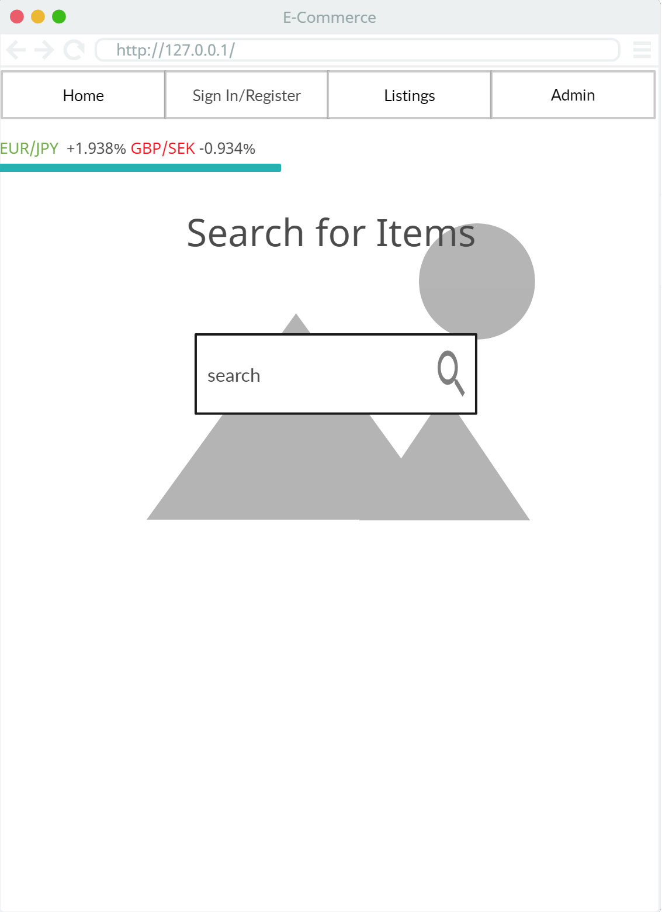
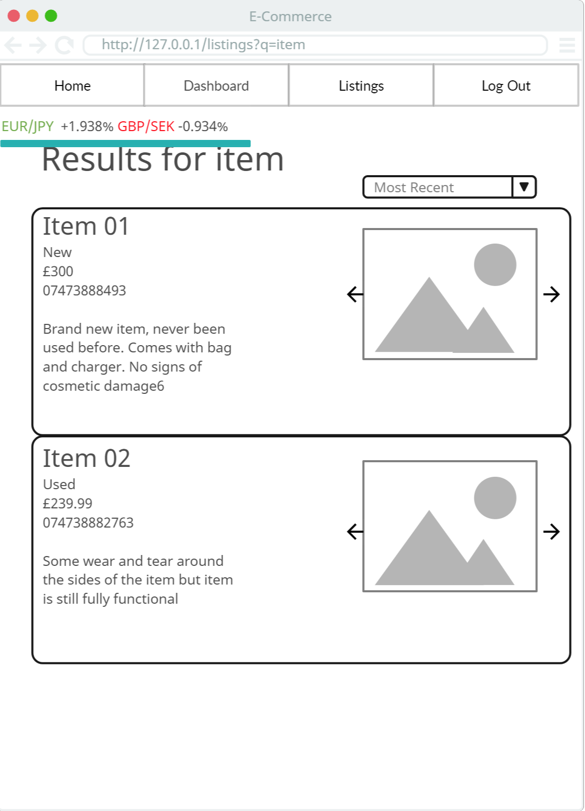
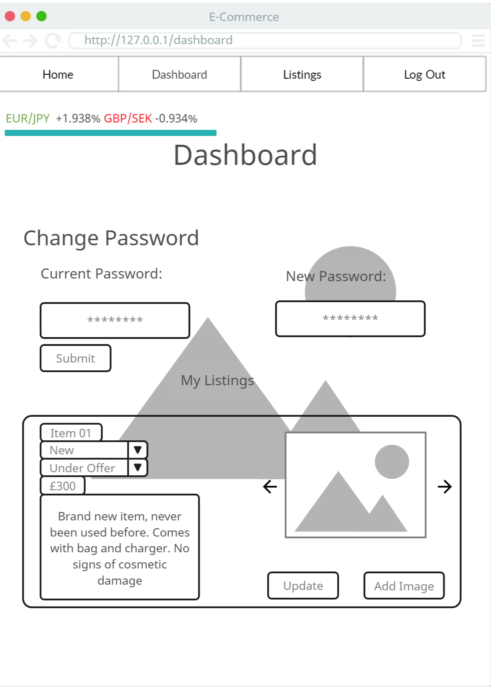
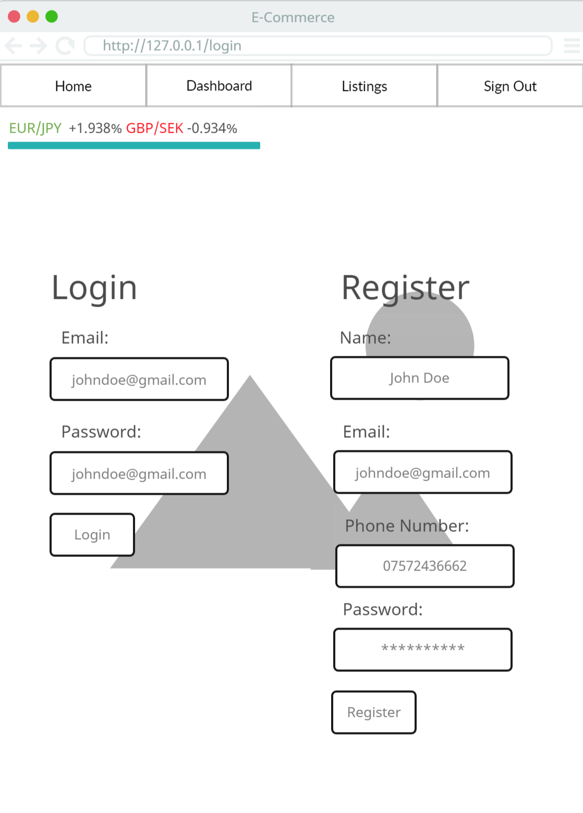
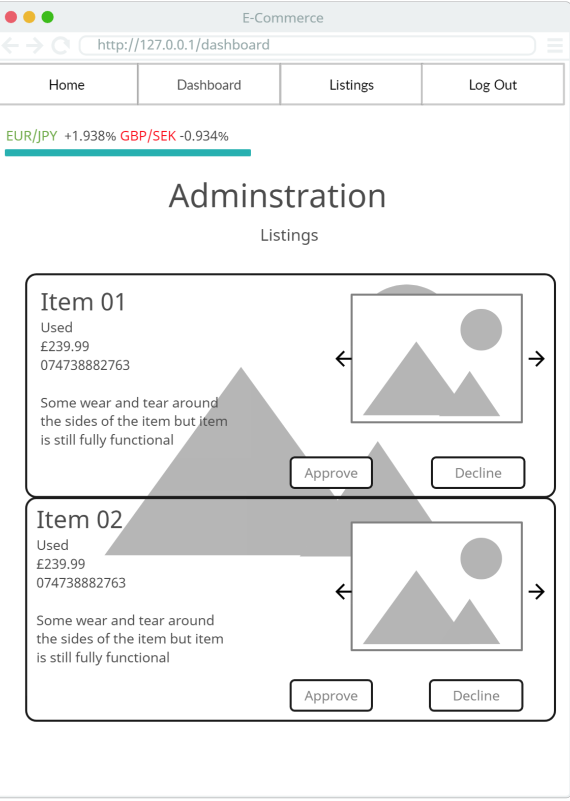
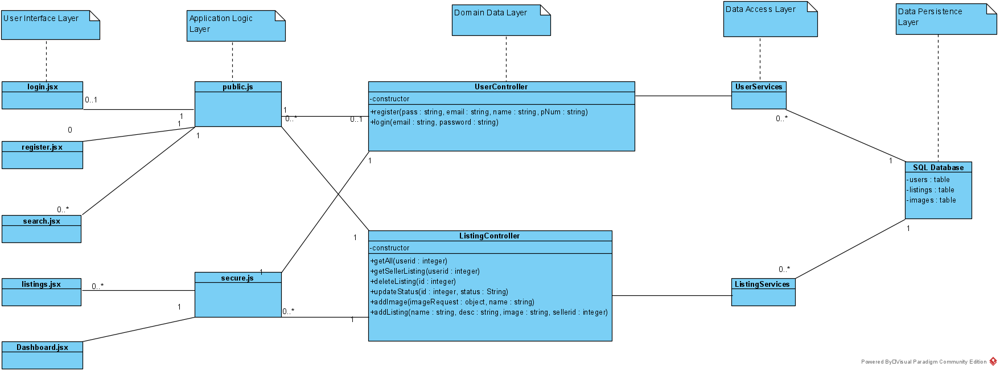

# E-Commerce Site (Challenge 6 Capstone)

For my capstone project, I will be creating an e-commerce site which will allow users to buy and sell items. Buyers will not have to register in order to contact sellers but sellers will have to register in order to list their items.  
Previously, people looking to sell unwanted items would have potential buyers limited to word of mouth. Having no platform to advertise their item would limit their audience and would potentially force them to sell at a lower price that they would not be happy with or even not sell at all. Conventional forms of advertising such as tv ads or billboards far outweigh the cost of most unwanted items so most people are limited to either telling friends and family about their item or selling at a boot sale which may only happen a couple times a year if ever. My project aims to solves this problem by giving users a free platform to advertise their items which they would like to sell and give them access to a number of prospective buyers, increasing the likelihood that they get close their asking price for said item. This platform would primarily be for users simply selling unwanted items but may also be used by traders who do not make enough to be taxed. Eventually we wish to expand the sites functionality to accommodate full time traders and even businesses but for the initial scope they will not be the target audience.  

## Features

The site will have a login/register system, allowing users to register an account if they would like to sell items on the site. Upon logging in, users will be able to add a new listing which can be viewed by both users and guests of the site. Sellers will be able to see their own listings, update the status of the listing and add additional images as well as change password and delete the listing should the item be sold. An administrative page will also be in place and allow administrators to approve listings before they go live.

The CRUD operations for this application are as follows

### CREATE

- Register Account
- Add new Listing
- Add Additional Image

### READ

- Get Listings
- Get Provisional Listings
- Log In

### UPDATE

- Update Password
- Make Provisional Listing Live
- Update Listing

### DELETE

- Remove Listing
- Decline provisional Listing

## Routing

The routes that the system will use as well as the respective headers and payloads are as follows:

- Request Type: GET
  URL: /listings
  PayLoad: {}
  Response: [@Listing]

- Request Type: GET
  URL: /listings/:q
  PayLoad: query
  Response: [@Listing]

- Request Type: POST
  URL: /login
  PayLoad: {email:String, password:String}
  Response: [auth token]

- Request Type: POST
  URL: /register
  PayLoad: {name: String, email:String, password:String, phoneNumber:String}
  Response: []

- Request Type: PUT
  URL: /listing/:id
  Header: auth token
  PayLoad: { listing@Listing}
  Response: []

- Request Type: POST
  URL: /listing/img/:id
  Header: auth token
  PayLoad: { listing@Listing, img@img }
  Response: []

- Request Type: PUT
  URL: /user/:id
  Header: auth token
  PayLoad: {currentPassword, newPassword}
  Response: []

- Request Type: DELETE
  URL: /listing/:id
  Header: auth token
  PayLoad: { listing@Listing }
  Response: []

  ## User Interface

### Search/MainPage

The main page will be a search form which will allow users to search for listings matching specific terms. A header and possibly footer will be present (as well as on all other pages) and the links shown will change dependant on the login status of the user of the site as well as the user that is logged in. A live ticker will also be in the header showing currency information for popular currencies.

### Listings

The listing page will be have a heading reading results for {query}. If the listing page is accessed directly (ie clicking listings in nav instead of getting there via search) then the latest listings approved will be shown. Users will be able to sort listings by most recent as well as oldest and price ascending and descending. Item information will be shown in a separate component which will be rendered inside of the listing page. This will have the item name, condition, price, description, images which will be a carousel and the sellers number.

### Dashboard

The seller dashboard will include 3 different components. One will be a form which allows users to change their password, one will be another form which will allow sellers to upload a new listing to be approved and the last will be of multiple forms which are of the same format of the add listing but prepopulated with the information of approved listings. The option to edit, add more images and delete the listing will be present

### Login/Register

The login/register page will have 2 form components side by side. One of which will allow users to log into the system using a email and password and the other will allow users to register for the site. Asking for the former 2 fields as well as name, and phone number.

### Admin

The Admin page will be a special page only available for admins, which can only be created directly via the database. Here listings that have been submitted by sellers but yet to be approved will be present. Admins will have the option to approve listings to go live or decline them should they feel they are not appropriate for the site. To which they will be deleted.

## Architecture

As shown in the class diagram, the application will use a 5 tier Architecture. The User Interface layer will be responsible for the user interface that is shown client side as well as also getting data for specific actions from the user.   The application logic layer will be responsible for routing actions to the specified route required for them, i.e. ensuring POST /login is actioned whenever the user clicked submit on the login portion of the SIGNUP/SIGNIN component. Some validation will also be present here.  The Domain Data Layer is responsible for calling the services and returning appropriate response and status code dependant on what the service returns.   The Data Access layer is responsible for actually actioning commands on the database(handing communication with db and performing CRUD operations) and returning whatever the database returns and the Data Persistence Layer is where the Database resides.

## Technologies

The technologies to be used:

### Front end

- Currency API (TBD)
- Axios
- Bootstrap
- React
- Vite
- Istanbul (testing)
- Testing library

### Back End

- Bcrypt
- Cors
- Express
- Express validator
- SQL/SQLite
- Mocha(testing)
- Istanbul (testing)
  ## Deployment
  The application will likely be deployed to Netlify. This will include both the front end and backend with an exception for the database. For this project a cloud-based SQL server will be used which the services will communicate with instead of utilizing SQLite directly on the backend. The reasoning behind this is that while SQLite would be much easier to set up and communicate with, scalability must be considered even in this early stage of development. When fully deployed a separate cloud-based database server may not be necessary but if/when the site begins making traction and traffic increases as a result, scaling up will prove difficult should we need multiple backend servers running to facilitate all users. An SQLite solution will result in multiple instances of the database running which would be catastrophic if left like that and would require additional work to migrate the database to the cloud. An SQLite solution MAY be used for development purposes but a cloud-based SQL server MUST be implemented for the final build of the site.
